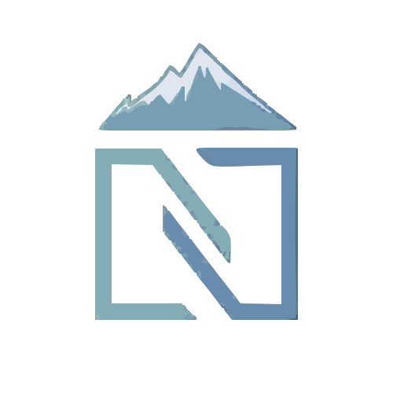

---

<div align="center">



# <samp>Nord Wallpapers</samp>

  

### <samp>A collection of wallpapers inspired by the Nord color palette, designed for use with various desktop setups and environments. These wallpapers offer a minimalist, clean, and visually pleasing aesthetic that aligns with the Nord theme. 🎨🌌</samp>
</div>

## Features ✨

- High-quality wallpapers in various resolutions. 📸
- Clean and minimalist design with colors from the Nord palette. 🌈
- Compatible with a variety of desktop environments. 🖥️
- Easy to use with a variety of configurations. ⚙️

## Installation 🛠️

To add the wallpapers to your setup:

1. Clone the repository:
   ```bash
   git clone https://github.com/Gurjaka/Nord-Wallpapers.git
   ```

2. Navigate to the wallpapers directory and choose your preferred wallpaper. 📂

## Usage 🔧

You can use these wallpapers on any desktop environment. Simply navigate to the downloaded wallpapers folder and set the image you prefer.

For example, to set a wallpaper using `feh` on Linux, run:
```bash
feh --bg-scale /path/to/wallpaper.jpg
```

## Contribution 🤝

Feel free to fork this repository and contribute by adding new wallpapers, improving existing ones, or submitting any suggestions. Open a pull request, and I will review it. 💻

## License 📜

This repository is licensed under the [MIT License](LICENSE). 🖤

---
